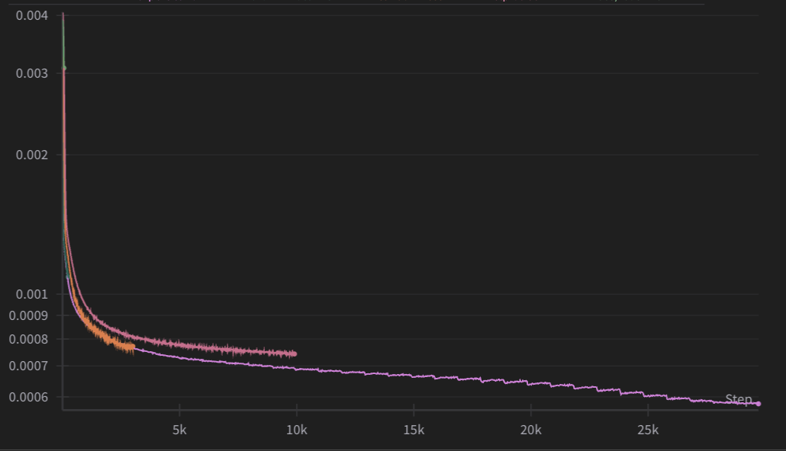

# Making DINOv2 Multi-Modal

DINOV2 ([paper](https://arxiv.org/abs/2304.07193)) has demonstrated state-of-the-art performance on numerous vision-related tasks, while-also excelling at meta-vision tasks such as depth map estimation, object segmentation, instance identification, and many others.

Despite its impressive capabilities, there has been a notable gap in aligning DINOV2 features with text embeddings. To address this, I tried to train a projection model that bridges DINOV2's visual representations with CLIP([paper](https://arxiv.org/abs/2103.00020))'s multimodal embeddings.

## Project Overview

The goal was to create a projection that allows DINOV2 embeddings to be used in CLIP-like multimodal tasks, potentially combining the strengths of both models. This alignment could enable powerful image-text retrieval capabilities while leveraging DINOV2's superior performance in various computer vision tasks.

## Methodology

1. **Model Architecture**: Implemented a ProjectorWithResiduals model to map DINOV2 embeddings to CLIP's embedding space. This architecture includes multiple residual blocks and normalization layers to facilitate effective alignment.

2. **Training Process**: The model was trained for 16 epochs using unit-norm MSE loss, I used CCM12m dataset from GDM, I was only able to use 8m of the image-text pairs, I employed the OneCycleLR scheduler to optimize the learning rate throughout training.

* I noticed larger batchsizes with deeper models tends to have both short-term and long-term convergence capacity.

3. **Datasets**: While training on a large, diverse dataset, I evaluated the model's performance on MSCOCO, Flickr8k, and Flickr30k to assess its generalization capabilities.

## How to use

1. download alignment model: [link to model](https://internalshare.s3.amazonaws.com/dinov2_alignment_model_epoch_16.pt)
2. adjust path on dinov2clip.py or wherever you're importing DinoV2Clip

## Results and Analysis

The projection model showed promising results, particularly on the Flickr datasets:

- **Flickr8k**: Achieved 89.27% and 89.90% of CLIP's performance for image and text retrieval, respectively.
- **Flickr30k**: Reached 92.10% and 91.53% of CLIP's performance for image and text retrieval.

However, performance on MSCOCO was more challenging:

- **MSCOCO**: Peaked at 82.90% and 77.57% of CLIP's performance for image and text retrieval at epoch 16, but saw a decline in later epochs.

The disparity in performance across datasets highlights the complexity of aligning these embedding spaces and the challenges in generalizing across diverse image-text distributions.

## Challenges and Insights

1. **Dataset Complexity**: The model's varying performance across datasets underscores the importance of diverse training data and the need for robust evaluation on multiple benchmarks.

2. **Optimization Dynamics**: Despite decreasing training loss, i observed performance drops on MSCOCO in later epochs, highlighting the intricate relationship between loss optimization and task-specific performance.

3. **Generalization vs. Specialization**: The model showed strong performance on Flickr datasets but struggled more with MSCOCO, indicating a potential trade-off between generalization and dataset-specific optimization.

## Future Directions

1. **Fine-tuning Strategies**: Explore targeted fine-tuning on challenging datasets like MSCOCO to improve performance.

2. **Architectural Enhancements**: Investigate more complex projection architectures or multi-task learning approaches to better capture the nuances of both DINOV2 and CLIP embeddings.

3. **Ensemble Methods**: Develop ensemble techniques combining models from different training stages to leverage their diverse strengths.

4. **Task-Specific Optimizations**: Tailor the alignment process for specific downstream tasks to maximize real-world applicability.

## Conclusion

This project demonstrates the potential of aligning DINOV2 features with CLIP-like text embeddings, showing  possibilities for multimodal AI applications. While challenges remain, particularly in generalizing across diverse datasets, the strong performance on Flickr datasets showcases the viability of this approach. 
